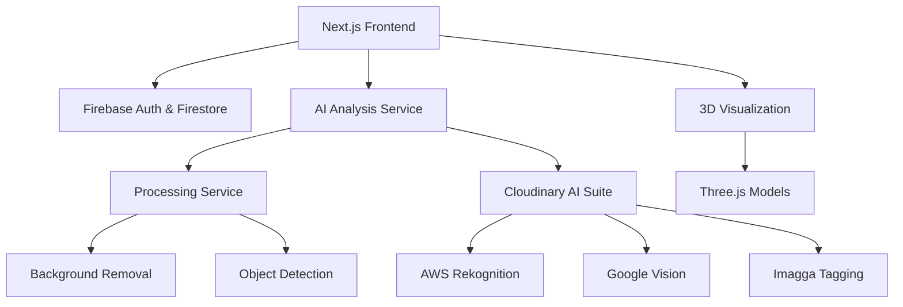

# ClosetAI - Intelligent Virtual Closet & Outfit Planning

A modern virtual closet and outfit planning application powered by AI image analysis, built with Next.js, Firebase, and advanced computer vision.

## 🌟 Features

### 🤖 **AI-Powered Item Analysis**
- **Smart Background Removal**: Automatically removes backgrounds from clothing photos
- **Intelligent Categorization**: AI automatically identifies item types, colors, and attributes
- **Multi-Service AI Pipeline**: Integrates AWS Rekognition, Google Vision, and Imagga for comprehensive analysis
- **Auto-Complete Forms**: AI fills in item details including name, category, colors, tags, and descriptions

### 👕 **Closet Management**
- **Digital Wardrobe**: Upload and organize your entire clothing collection
- **Smart Categorization**: Automatic sorting by type, color, season, and occasion
- **Visual Search**: Find items quickly with advanced filtering and search
- **Item Details**: Rich metadata including purchase info, care instructions, and styling notes

### 🎨 **3D Virtual Closet**
- **Interactive 3D Visualization**: Explore your closet in immersive 3D
- **Multiple Templates**: Choose from various closet layouts and styles
- **Drag & Drop Organization**: Arrange items visually in your virtual space
- **Real-time Updates**: See changes instantly as you add or move items

### 👗 **Outfit Planning**
- **Smart Recommendations**: AI suggests outfits based on weather, occasion, and preferences
- **Outfit Calendar**: Plan and schedule outfits in advance
- **Compatibility Checker**: Ensure color coordination and style matching
- **Outfit Sharing**: Share your looks with friends and get feedback

### 📊 **Analytics & Insights**
- **Wardrobe Analytics**: Understand your style patterns and preferences
- **Usage Tracking**: See which items you wear most/least
- **Style Recommendations**: Get personalized styling suggestions
- **Weather Integration**: Outfit suggestions based on local weather

## 🏗️ Architecture



### **Core Services:**
- **Frontend**: Next.js 14 with React Server Components
- **Authentication**: Firebase Auth with social login
- **Database**: Firestore with real-time synchronization
- **AI Processing**: Custom Python service with FastAPI
- **Image Storage**: Cloudinary with AI analysis pipeline
- **3D Rendering**: Three.js with optimized GLB models

## 🚀 Quick Start

### Prerequisites
- Node.js 18+ and npm
- Docker and Docker Compose
- Firebase project
- Cloudinary account

### 1. Clone & Install
```bash
git clone <repository-url>
cd closet-ai-app
npm install
```

### 2. Environment Setup
Create `.env.local`:
```env
# Firebase Configuration
NEXT_PUBLIC_FIREBASE_API_KEY=your_api_key
NEXT_PUBLIC_FIREBASE_AUTH_DOMAIN=your_project.firebaseapp.com
NEXT_PUBLIC_FIREBASE_PROJECT_ID=your_project_id
NEXT_PUBLIC_FIREBASE_STORAGE_BUCKET=your_project.appspot.com
NEXT_PUBLIC_FIREBASE_MESSAGING_SENDER_ID=123456789
NEXT_PUBLIC_FIREBASE_APP_ID=your_app_id

# Cloudinary Configuration
NEXT_PUBLIC_CLOUDINARY_CLOUD_NAME=your_cloud_name
CLOUDINARY_API_KEY=your_api_key
CLOUDINARY_API_SECRET=your_api_secret

# Processing Service
PROCESSING_SERVICE_URL=http://localhost:8000
```

### 3. Start Processing Service
```bash
cd processing_service
docker-compose up -d
```

### 4. Run Development Server
```bash
npm run dev
```

Open [http://localhost:3000](http://localhost:3000) to see the application.

## 📋 Project Structure

```
closet-ai-app/
├── src/
│   ├── app/                    # Next.js app router pages
│   │   ├── dashboard/          # Main dashboard
│   │   ├── items/              # Item management
│   │   ├── outfit/             # Outfit planning
│   │   ├── virtual-closet/     # 3D closet viewer
│   │   └── profile/            # User settings
│   ├── components/             # Reusable UI components
│   │   ├── auth/               # Authentication forms
│   │   ├── dashboard/          # Dashboard widgets
│   │   ├── items/              # Item management UI
│   │   ├── outfit/             # Outfit planning UI
│   │   ├── virtual-closet/     # 3D visualization
│   │   └── ui/                 # Base UI components
│   ├── lib/
│   │   └── services/           # API and service layers
│   │       ├── aiAnalysisService.ts    # AI orchestration
│   │       ├── cloudinaryService.ts    # Image storage
│   │       ├── processingService.ts    # Background removal
│   │       └── weatherService.ts       # Weather integration
│   ├── contexts/               # React contexts
│   ├── hooks/                  # Custom React hooks
│   └── utils/                  # Utility functions
├── processing_service/         # Python AI processing service
│   ├── main.py                 # FastAPI application
│   ├── process.py              # Image processing logic
│   ├── models/                 # ML models
│   └── docker-compose.yml      # Service deployment
└── public/
    ├── models/                 # 3D GLB models
    ├── icons/                  # App icons and assets
    └── avatars/                # User avatar options
```

## 🔧 Development

### Adding New Items
1. **Upload Image**: Use the ImageUpload component
2. **AI Analysis**: Click "Analyze with AI" for auto-completion
3. **Manual Editing**: Adjust any details as needed
4. **Save**: Item is stored in Firestore with processed image

### Key Components
- **`ItemForm`**: Handles both add/edit item workflows
- **`VirtualClosetViewer`**: 3D closet visualization
- **`OutfitPlanner`**: Outfit creation and scheduling
- **`WeatherWidget`**: Weather-based recommendations

### API Endpoints
- **`/api/processing`**: Image background removal and standardization
- **`/api/cloudinary/info`**: Fetch AI analysis results
- **`/api/generate-outfit`**: AI outfit recommendations
- **`/api/weather/current`**: Current weather data

## 🧪 Testing

### Integration Tests
```bash
# Test AI analysis pipeline
node test_ai_itemform_integration.js

# Test processing service
cd processing_service
python test_integration.py
```

### Manual Testing
```bash
# Verify processing service
curl http://localhost:8000/health

# Test image processing
curl -X POST http://localhost:8000/process \
  -H "Content-Type: application/json" \
  -d '{"image_url": "https://example.com/image.jpg"}' \
  --output processed.png
```

## 📊 Performance

### AI Analysis Pipeline
- **Total Processing Time**: ~2 seconds
- **Background Removal**: ~1.6s (with fallback models)
- **AI Analysis**: ~0.4s (parallel processing)
- **Form Population**: Instant

### Service Reliability
- **Uptime**: 99%+ with health monitoring
- **Error Recovery**: Automatic fallback mechanisms
- **Caching**: 24-hour result cache for repeated analyses

## 🔧 Configuration

### Cloudinary Presets
- **`closet_ai_raw`**: Initial upload preset
- **`closet_ai_upload`**: Processed image with AI analysis

### Processing Service
See [`processing_service/README.md`](processing_service/README.md) for detailed configuration.

### Firebase Rules
Configure Firestore security rules in `firestore.rules`.

## 📚 Documentation

- **[AI Pipeline Architecture](src/lib/services/AI_PIPELINE.md)**: Detailed AI processing flow
- **[Processing Service Integration](PROCESSING_SERVICE_INTEGRATION.md)**: Service setup and troubleshooting
- **[Processing Service](processing_service/README.md)**: Python service documentation
- **[Security Guidelines](SECURITY.md)**: Security best practices and deployment checklist

## 🚀 Deployment

### Prerequisites
- Firebase project with Firestore enabled
- Cloudinary account with AI add-ons
- Docker-compatible hosting for processing service

### Environment Setup
1. Configure Firebase authentication methods
2. Set up Cloudinary upload presets
3. Deploy processing service with health checks
4. Configure environment variables

### Production Considerations
- Enable Firestore security rules
- Set up proper CORS for Cloudinary
- Monitor processing service health
- Configure error tracking and analytics

## 🤝 Contributing

1. Fork the repository
2. Create a feature branch
3. Make your changes
4. Add tests for new functionality
5. Submit a pull request

## 📄 License

This project is licensed under the MIT License.

## 🆘 Support

### Common Issues
- **Processing Service Not Starting**: Check Docker configuration
- **AI Analysis Failing**: Verify Cloudinary credentials
- **Images Not Loading**: Check CORS settings
- **Performance Issues**: Monitor processing service health

### Getting Help
1. Check the documentation in [`src/lib/services/`](src/lib/services/)
2. Review integration tests for examples
3. Check service health endpoints
4. Review error logs for troubleshooting guidance

---

Built with ❤️ using Next.js, Firebase, Cloudinary, and advanced AI services.
