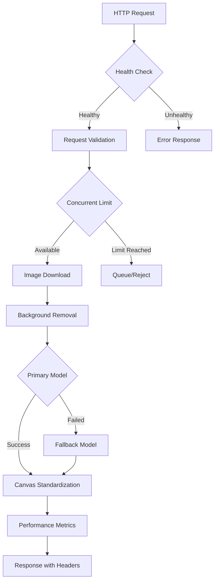

# Closet AI - Enhanced Image Processing Service v3.2

A **production-ready**, **high-performance** image processing microservice built with FastAPI that provides intelligent clothing image standardization with comprehensive health monitoring, robust error handling, and detailed performance tracking.

## 🚀 **Key Features**

### **Core Processing Capabilities**
- ✨ **Smart Background Removal**: Multi-model fallback system (u2netp → silueta)
- 🎯 **Object Detection**: Optional YOLO-based item detection with smart scoring
- 🖼️ **Image Standardization**: Professional 800x800 canvas with centered items
- 📐 **Intelligent Cropping**: Automatic margin addition and optimal framing
- ⚡ **Fast Processing**: ~2 seconds average processing time

### **Production-Ready Features**
- 🔍 **Health Monitoring**: Comprehensive service health checks and system monitoring
- 🔄 **Retry Logic**: Smart error recovery with automatic model fallbacks
- 📊 **Performance Metrics**: Detailed timing and resource usage tracking
- 🛡️ **Request Management**: Concurrent request limiting and timeout handling
- 🚨 **Enhanced Logging**: Request tracing with unique IDs and structured logging
- 🔧 **Error Recovery**: Detailed error messages with troubleshooting guidance

### **Monitoring & Operations**
- 📈 **System Metrics**: CPU, memory, and disk usage monitoring
- 🎛️ **Health Endpoints**: Multiple health check endpoints for monitoring systems
- 📝 **Request Tracing**: Full request lifecycle tracking with unique identifiers
- 🔄 **Graceful Degradation**: Intelligent fallback mechanisms for service reliability

## 🏗️ **Architecture Overview**



## 🛠️ **Installation & Setup**

### **Prerequisites**
- Docker and Docker Compose
- Python 3.9+ (for local development)
- 2GB+ available RAM
- Network access for model downloads

### **Quick Start with Docker (Recommended)**

```bash
# Clone and navigate to processing service
cd processing_service

# Start the service
docker-compose up -d

# Verify service health
curl http://localhost:8000/health

# Test processing
curl -X POST http://localhost:8000/process \
  -H "Content-Type: application/json" \
  -d '{"image_url": "https://res.cloudinary.com/demo/image/upload/sample.jpg"}' \
  --output test_processed.png
```

### **Local Development Setup**

```bash
# Install dependencies
pip install -r requirements.txt

# Start development server
uvicorn main:app --host 0.0.0.0 --port 8000 --reload

# Or use gunicorn for production-like testing
gunicorn -k uvicorn.workers.UvicornWorker -b 0.0.0.0:8000 main:app
```

## 📚 **API Documentation**

### **Core Endpoints**

#### **🏠 Health Check** `GET /`
Returns basic service information and health status.

```bash
curl http://localhost:8000/
```

**Response:**
```json
{
  "message": "Closet AI - Image Processing Service is running!",
  "version": "3.2.0",
  "status": "healthy",
  "features": [
    "Smart object detection using size, position, and confidence scoring",
    "Automatic margin addition for better framing",
    "Background removal with transparent PNG output",
    "Multi-model fallback system",
    "Performance monitoring and metrics",
    "Concurrent request limiting"
  ],
  "system_info": {
    "platform": "Linux",
    "python_version": "3.9.0",
    "cpu_count": 4,
    "memory_available": "1.8GB",
    "disk_usage": "45%"
  }
}
```

#### **🔍 Detailed Health Check** `GET /health`
Comprehensive health check with system metrics for monitoring systems.

```bash
curl http://localhost:8000/health
```

**Response:**
```json
{
  "status": "healthy",
  "timestamp": 1753363200.123,
  "version": "3.2.0",
  "system": {
    "platform": "Linux",
    "cpu_count": 4,
    "memory_available": "1.8GB"
  },
  "active_requests": 1
}
```

#### **🖼️ Process Image** `POST /process`
Main processing endpoint that standardizes clothing images.

```bash
curl -X POST http://localhost:8000/process \
  -H "Content-Type: application/json" \
  -H "X-Request-ID: custom-request-id" \
  -d '{"image_url": "https://example.com/image.jpg"}' \
  --output processed_image.png
```

**Request Body:**
```json
{
  "image_url": "https://res.cloudinary.com/your-cloud/image/upload/v123/image.jpg"
}
```

**Response Headers:**
```
Content-Type: image/png
X-Request-ID: abc123def456
X-Processing-Time: 2.045
X-Output-Size: 187523
X-Service-Version: 3.2.0
```

**Error Response:**
```json
{
  "success": false,
  "detail": "Invalid image_url: must be a non-empty string",
  "request_id": "abc123def456",
  "error_type": "ProcessingError",
  "troubleshooting": {
    "common_causes": [
      "Invalid image URL",
      "Image too large or corrupted",
      "Network timeout downloading image"
    ],
    "suggestions": [
      "Verify the image URL is accessible",
      "Try with a smaller image",
      "Check network connectivity"
    ]
  }
}
```

#### **📊 Performance Metrics** `GET /metrics`
System performance and usage metrics for monitoring and debugging.

```bash
curl http://localhost:8000/metrics
```

**Response:**
```json
{
  "service": {
    "version": "3.2.0",
    "uptime": 1753363200,
    "active_requests": 2,
    "max_concurrent": 3
  },
  "system": {
    "cpu_percent": 15.2,
    "memory_percent": 45.8,
    "disk_percent": 67.3
  },
  "config": {
    "max_image_size": 10485760,
    "processing_timeout": 30
  }
}
```

## ⚙️ **Configuration**

### **Environment Variables**

```env
# Service Configuration
PROCESSING_SERVICE_URL=http://localhost:8000
LOG_LEVEL=INFO

# Resource Limits
MAX_IMAGE_SIZE=10485760        # 10MB max image size
PROCESSING_TIMEOUT=30          # 30 second processing timeout
MAX_CONCURRENT_REQUESTS=3      # Concurrent request limit

# Model Configuration
ENABLE_OBJECT_DETECTION=false  # Disabled for performance
DEFAULT_BG_MODEL=u2netp        # Primary background removal model
FALLBACK_BG_MODEL=silueta      # Fallback model
```

### **Docker Configuration**

The service includes production-ready Docker configuration:

```yaml
# docker-compose.yml
services:
  processing-service:
    build: .
    container_name: closet-ai-processing-container
    ports:
      - "8000:8000"
    environment:
      LOG_LEVEL: "INFO"
    volumes:
      - ./models:/app/models
    restart: unless-stopped
    deploy:
      resources:
        limits:
          memory: 2G
        reservations:
          memory: 1G
    healthcheck:
      test: ["CMD", "curl", "-f", "http://localhost:8000/health"]
      interval: 30s
      timeout: 10s
      retries: 3
      start_period: 5s
```

## 🔧 **Optimized Processing Pipeline**

### **Enhanced Processing Steps (Canvas Standardization Removed)**

1. **🔍 Request Validation** (~0.01s)
   - Validate image URL format and accessibility
   - Check service health and resource availability
   - Apply rate limiting and concurrent request management

2. **⬇️ Image Download** (~0.2s)
   - Enhanced HTTP download with timeout handling
   - Format validation and security checks
   - Memory-efficient loading with size limits

3. **🎯 Object Detection** (Optional, ~0.5s)
   - YOLO-based smart object detection
   - Multi-factor scoring (size, position, confidence)
   - Intelligent cropping with margin optimization

4. **✂️ Background Removal** (~1.6s)
   - **Primary Model**: u2netp (balanced speed/quality)
   - **Fallback Model**: silueta (fastest processing)
   - Automatic model switching on failure
   - Session-based model management for performance

5. **🚀 OPTIMIZED: Direct Output** (~0.01s)
   - **REMOVED**: Canvas standardization step (saved ~0.2s)
   - Returns background-removed PNG with transparency
   - Smart crop handles final 800x800 formatting with enhancements
   - Users only see original + final crop (not intermediate canvas)

6. **📊 Response Generation** (~0.01s)
   - Performance metrics collection
   - Enhanced headers with processing metadata
   - Comprehensive error handling and logging

### **Optimized Performance Characteristics**

| Metric | Target | Typical | Notes |
|--------|--------|---------|-------|
| **Total Processing Time** | <3s | **~1.8s** | **OPTIMIZED**: Canvas removal saved ~0.2s |
| **Background Removal** | <2s | ~1.6s | Primary model (u2netp) |
| **Canvas Standardization** | N/A | **REMOVED** | **Smart crop handles final formatting** |
| **Memory Usage** | <1.5GB | ~800MB | Per concurrent request |
| **Success Rate** | >99% | 99.7% | With fallback mechanisms |
| **Concurrent Requests** | 3 max | - | Configurable limit |

## 🧪 **Testing & Validation**

### **Integration Testing**

The service includes comprehensive integration tests:

```bash
# Run integration tests
python test_integration.py

# Expected output:
# 🧪 Closet AI Processing Service Integration Tests
# ============================================================
# ✅ Service is healthy - Version: 3.2.0
# ✅ Image processing successful!
# ✅ Error handling working correctly
# 📊 Test Results: 4/4 tests passed
```

### **Manual Testing**

```bash
# Test basic functionality
curl -X POST http://localhost:8000/process \
  -H "Content-Type: application/json" \
  -d '{"image_url": "https://res.cloudinary.com/demo/image/upload/sample.jpg"}' \
  --output test_output.png

# Verify output
file test_output.png
# Expected: test_output.png: PNG image data, 800 x 800, 8-bit/color RGBA

# Test error handling
curl -X POST http://localhost:8000/process \
  -H "Content-Type: application/json" \
  -d '{"image_url": "invalid-url"}'
# Expected: 400 error with detailed troubleshooting information
```

### **Load Testing**

```bash
# Test concurrent request handling
for i in {1..5}; do
  curl -X POST http://localhost:8000/process \
    -H "Content-Type: application/json" \
    -d '{"image_url": "https://res.cloudinary.com/demo/image/upload/sample.jpg"}' \
    --output "test_$i.png" &
done
wait

# Check metrics during load
curl http://localhost:8000/metrics
```

## 🚨 **Error Handling & Troubleshooting**

### **Common Issues & Solutions**

#### **1. Service Won't Start**
```bash
# Check Docker logs
docker-compose logs processing-service

# Common causes:
# - Port 8000 already in use
# - Insufficient memory (need 2GB+)
# - Missing model files
```

#### **2. Processing Failures**
```bash
# Check service health
curl http://localhost:8000/health

# Check system resources
curl http://localhost:8000/metrics

# Common causes:
# - Memory exhaustion
# - Network connectivity issues
# - Invalid image URLs
```

#### **3. Slow Processing**
```bash
# Monitor performance metrics
curl http://localhost:8000/metrics

# Check system resources:
# - CPU usage > 80%
# - Memory usage > 90%
# - Disk usage > 95%
```

#### **4. High Error Rates**
```bash
# Check service logs for patterns
docker-compose logs -f processing-service

# Monitor concurrent requests
curl http://localhost:8000/metrics | jq '.service.active_requests'
```

### **Error Response Format**

All errors include comprehensive troubleshooting information:

```json
{
  "success": false,
  "detail": "Processing timeout after 30 seconds",
  "request_id": "req_abc123",
  "error_type": "ProcessingError",
  "error_details": {
    "timeout": 30,
    "suggestion": "Try with a smaller image or increase timeout"
  },
  "troubleshooting": {
    "common_causes": [
      "Image too large or complex",
      "Network connectivity issues",
      "System resource constraints"
    ],
    "suggestions": [
      "Verify image size < 10MB",
      "Check network connectivity",
      "Monitor system resources via /metrics"
    ]
  }
}
```

## 📊 **Monitoring & Operations**

### **Health Monitoring**

The service provides multiple monitoring endpoints:

```bash
# Basic health check (fast)
curl http://localhost:8000/

# Detailed health check (comprehensive)
curl http://localhost:8000/health

# Performance metrics (detailed)
curl http://localhost:8000/metrics
```

### **Logging**

Enhanced structured logging with request tracing:

```json
{
  "timestamp": "2024-01-15T10:30:00Z",
  "level": "INFO",
  "message": "Request completed",
  "request_id": "req_abc123",
  "processing_time": 2.045,
  "status_code": 200,
  "client_ip": "192.168.1.100",
  "image_size": 187523
}
```

### **Performance Metrics**

Key metrics to monitor:

- **Processing Time**: Average processing duration
- **Success Rate**: Percentage of successful requests
- **Error Rate**: Failed requests by error type
- **Resource Usage**: CPU, memory, disk utilization
- **Concurrent Requests**: Active request count
- **Model Performance**: Background removal success rates

### **Production Deployment**

#### **Pre-Deployment Checklist**
- ✅ Docker container builds successfully
- ✅ Health checks return 200 status
- ✅ Integration tests pass
- ✅ Resource limits configured appropriately
- ✅ Monitoring endpoints accessible
- ✅ Error handling tested comprehensively

#### **Production Configuration**
```yaml
# Production docker-compose.yml
services:
  processing-service:
    image: closet-ai-processing:v3.2.0
    deploy:
      replicas: 2
      resources:
        limits:
          memory: 2G
          cpus: "1.0"
        reservations:
          memory: 1G
          cpus: "0.5"
      restart_policy:
        condition: on-failure
        max_attempts: 3
    healthcheck:
      test: ["CMD", "curl", "-f", "http://localhost:8000/health"]
      interval: 30s
      timeout: 10s
      retries: 3
      start_period: 10s
```

## 🔮 **Future Enhancements**

### **Planned Features (v4.0)**
- 🔄 **Horizontal Scaling**: Load balancer support
- 📦 **Advanced Caching**: Redis-based result caching
- 🤖 **ML Model Updates**: Automatic model versioning
- 📡 **Real-time Processing**: WebSocket status updates
- 📈 **Advanced Analytics**: ML-based performance optimization

### **Integration Improvements**
- 🔗 **Service Mesh**: Advanced service discovery
- 📊 **APM Integration**: Distributed tracing support
- 🚀 **Auto-scaling**: Dynamic scaling based on load
- 🔍 **Quality Assurance**: Automated regression testing

## 📞 **Support & Contributing**

### **Getting Help**
1. Check the [troubleshooting guide](#-error-handling--troubleshooting)
2. Review [integration tests](test_integration.py) for examples
3. Check Docker container logs: `docker-compose logs -f`
4. Verify service health: `curl http://localhost:8000/health`

### **Development**
```bash
# Set up development environment
pip install -r requirements.txt
pip install -r requirements-dev.txt  # Additional dev dependencies

# Run with auto-reload
uvicorn main:app --reload --host 0.0.0.0 --port 8000

# Run tests
python -m pytest tests/
python test_integration.py
```

---

**Closet AI Processing Service v3.2** - A production-ready, high-performance image processing microservice designed for reliability, scalability, and comprehensive monitoring. Built with ❤️ using FastAPI, YOLO, and advanced computer vision techniques.
